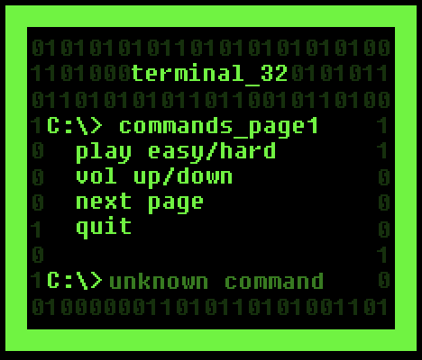

# Terminal_32
You are a hacker trying to get to the terminal. What stops you is a bunch of data walls and binary codes. At start, you have 32 seconds, but you can have flashing batteries to help you in your task. 
This is the first game I ever made! Originally crafted in 48h for the NES Jam and later refined.

